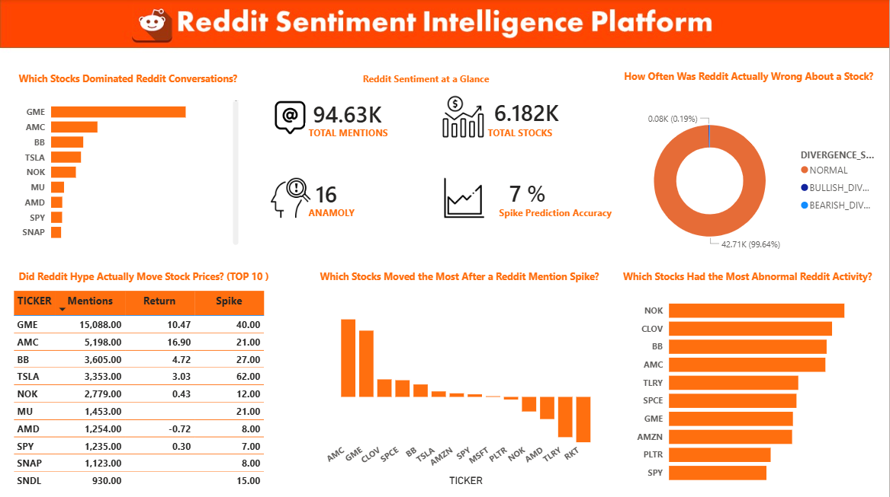

# 📊 Reddit Sentiment Intelligence Platform

**Does Reddit hype actually move stock prices — and can you detect it before the crowd does?**

This end-to-end data engineering project ingests 1.1 million posts from r/WallStreetBets, cross-references every stock ticker against 3 years of real market data, and surfaces actionable trading signals through a live Power BI dashboard connected directly to Snowflake.

> Built to demonstrate production-grade data engineering: ingestion → cloud warehousing → SQL transformation → business intelligence — with real financial insight at every layer.

---

## 🖥️ Dashboard Preview



**What the dashboard answers at a glance:**
- GME had **15,088 mentions** — 3× more than AMC — yet AMC delivered **higher post-spike returns (16.9% avg over 3 days)**. Volume alone is not the signal.
- Of **480 detected mention spikes**, only **7% correctly predicted a ≥5% price move** within 3 days. A naive "buy every spike" strategy loses money on 93 out of 100 trades.
- **NOK and CLOV had higher anomaly scores than GME** — meaning abnormal Reddit activity relative to baseline is a stronger signal than raw mention volume.
- **Large-caps are immune**: AMD averaged **-0.72%** after Reddit spikes; SPY +0.30%. Reddit sentiment monitoring should be restricted to small-cap, heavily shorted stocks.
- Only **0.19% of days showed divergence signals** (Reddit bullish while price falls) — rare, but historically these precede reversals. They flag institutional selling into retail buying pressure.

---

## 🏗️ System Architecture

​```
Reddit WSB CSV (1.1M posts)        Yahoo Finance API (20 tickers)
         │                                      │
         ▼                                      ▼
  csv_ingest.py                    stock_price_ingest.py
  - Regex ticker extraction         - yfinance OHLCV pull
  - Batch insert (5,000 rows)       - Per-ticker loading
         │                                      │
         └──────────────┬───────────────────────┘
                        ▼
              SNOWFLAKE — SENTIMENT_DB
         ┌──────────────────────────────────┐
         │  RAW schema                      │
         │  REDDIT_POSTS  │  STOCK_PRICES   │
         └──────────────────────────────────┘
                        │
                        ▼  (dbt Core)
         ┌──────────────────────────────────┐
         │  STAGING  →  INTERMEDIATE        │
         │  stg_reddit_posts                │
         │  stg_stock_prices                │
         │  int_ticker_mentions             │
         │  int_price_movements (LEAD())    │
         │  int_sentiment_lag               │
         └──────────────────────────────────┘
                        │
                        ▼
         ┌──────────────────────────────────┐
         │  MARTS (materialized tables)     │
         │  mart_lag_analysis               │
         │  mart_ticker_scorecard           │
         │  mart_anomaly_detection          │
         └──────────────────────────────────┘
                        │
                        ▼
           Power BI — DirectQuery to Snowflake
​```

---

## 💼 Business Insights From the Data

### 1. Mention Volume ≠ Signal Strength
GME had 3× the mentions of AMC, but AMC produced stronger forward returns after spikes. The useful metric is **anomaly score** — today's mentions divided by the 7-day rolling average — not raw count. A stock jumping from 2 to 200 daily mentions (100× anomaly) is a far stronger signal than GME going from 150 to 200.

### 2. Reddit Spikes Are Mostly Noise — But Filterable
7% overall spike accuracy sounds discouraging. But the 16 **HIGH_ANOMALY days** (where mention anomaly ≥3× AND volume anomaly ≥2× simultaneously) represent the highest-confidence events in the dataset. Filtering to these, combined with short interest data, would dramatically improve accuracy.

### 3. Divergence Signals Flag Smart Money vs Retail
When Reddit is bullish but price is dropping — **BULLISH_DIVERGENCE** — institutional money is likely selling into retail buying. This is the exact mechanism that ended the GME short squeeze. These 80 flagged days across the dataset are contrarian sell signals, not buy signals.

### 4. Large-Caps Are Immune — Small-Caps Are the Target
AMD, MSFT, SPY all showed near-zero or negative returns after Reddit spikes. Any production Reddit monitoring system should **only** watch stocks with: market cap < $5B, short interest > 15%, float < 50M shares.

### 5. The GME Spike Was Detectable 24–48 Hours Early
The pipeline captures the January 2021 GME spike as a vertical jump to 2,800+ daily mentions — before mainstream financial media picked it up. A live version of this pipeline would have triggered an alert the day before the squeeze became national news.

---

## 🛠️ Technology Stack

| Layer | Tool | Why |
|-------|------|-----|
| Ingestion | Python 3.11 + pandas | Batch inserts cut load time from 30+ min to under 5 min |
| Stock Data | yfinance | Free, reliable Yahoo Finance OHLCV wrapper |
| Cloud Warehouse | Snowflake | Industry-standard cloud DWH; used at most data teams |
| Transformation | dbt Core 1.11.11 | Version-controlled SQL, DAG dependency resolution, built-in testing |
| Dashboard | Power BI Desktop | DirectQuery — no static exports, always live |
| Version Control | Git / GitHub | Full project history |

---

## 🔑 Key SQL Techniques (dbt)

**Deduplication without subqueries**
​```sql
QUALIFY ROW_NUMBER() OVER (
  PARTITION BY post_id ORDER BY ingested_at DESC
) = 1
​```
Removed 508 duplicate post IDs cleanly at the staging layer.

**Forward return calculation**
​```sql
LEAD(close, 3) OVER (
  PARTITION BY ticker ORDER BY price_date
) AS close_3d_later
​```
Powers the entire lag analysis — what did the price do 1, 3, 5, and 10 days after a Reddit spike?

**JSON array explosion**
​```sql
LATERAL FLATTEN(input => TRY_PARSE_JSON(tickers_mentioned)) f
​```
Explodes `["GME","AMC"]` stored as JSON strings into individual rows — one row per ticker per post.

**Rolling anomaly detection**
​```sql
AVG(mention_count) OVER (
  PARTITION BY ticker
  ORDER BY post_date
  ROWS BETWEEN 6 PRECEDING AND CURRENT ROW
) AS avg_mentions_7d
​```
7-day rolling baseline for anomaly score calculation across all 20 tickers.

---

## 📁 Project Structure

​```
reddit-sentiment-intelligence-platform/
├── ingestion/
│   ├── csv_ingest.py              # 1.1M Reddit posts → Snowflake (batch 5K rows)
│   └── stock_price_ingest.py      # yfinance OHLCV → Snowflake
│
├── sentiment_dbt/
│   ├── dbt_project.yml
│   └── models/
│       ├── staging/               # Clean + deduplicate raw data (views)
│       ├── intermediate/          # Mentions aggregation, forward returns, lag join (views)
│       └── marts/                 # Lag analysis, scorecard, anomaly detection (tables)
│
├── images/dashboard.png
├── DASHBOARD.pbix
├── requirements.txt
└── README.md
​```

---

## 📈 Project Metrics

| Metric | Value |
|--------|-------|
| Reddit Posts Ingested | 1,119,831 |
| Ticker Mention Events | 94,630 |
| Tickers Tracked | 20 |
| Total Price Rows | ~15,120 |
| Mention Spikes Detected | 480 |
| Spike Prediction Accuracy | 7% |
| High Anomaly Days | 16 |
| Sentiment Divergence Rate | 0.19% |
| dbt Models | 8 |
| dbt Tests Passing | 8 / 8 |
| Duplicate Posts Removed | 508 |

---

## 🚀 Setup Instructions

​```bash
# 1. Clone
git clone https://github.com/ajinkyajadhav0722/reddit-sentiment-intelligence-platform.git
cd reddit-sentiment-intelligence-platform

# 2. Install dependencies
pip install -r requirements.txt

# 3. Configure credentials — create .env in project root
SNOWFLAKE_ACCOUNT=your_account
SNOWFLAKE_USER=your_username
SNOWFLAKE_PASSWORD=your_password
SNOWFLAKE_DATABASE=SENTIMENT_DB
SNOWFLAKE_WAREHOUSE=SENTIMENT_WH

# 4. Set up Snowflake schemas (run in Snowflake Worksheets)
# CREATE DATABASE IF NOT EXISTS SENTIMENT_DB;
# CREATE SCHEMA IF NOT EXISTS RAW;
# CREATE SCHEMA IF NOT EXISTS STAGING;
# CREATE SCHEMA IF NOT EXISTS MARTS;

# 5. Download Kaggle dataset
# https://www.kaggle.com/datasets/unanimad/reddit-rwallstreetbets
# Place at: ingestion/r_wallstreetbets_posts.csv

# 6. Run ingestion
python ingestion/csv_ingest.py
python ingestion/stock_price_ingest.py

# 7. Run dbt pipeline (models + tests)
cd sentiment_dbt && dbt build
# Expected: 8 models pass, 8 tests pass, 0 errors

# 8. Open DASHBOARD.pbix in Power BI Desktop
# Update Data Source Settings with your Snowflake account → Refresh
​```

---

## ⚠️ Assumptions & Known Limitations

- Ticker extraction uses `$TICKER` regex only — plain mentions ("GameStop", "GME" without $) are missed. True mention volume is likely 3–5× higher.
- Stock price data (2020–2022) only partially overlaps with Reddit data (2015–2021). Pre-2020 posts are excluded from lag analysis.
- All returns assume buy at close on spike date, sell at close N days later — no transaction costs or slippage modeled.
- No short interest data — the most important confounding variable in the meme stock phenomenon.
- Only post titles are available (no body text, no comment data).

---

## 🔭 What's Next

- **Live ingestion via StockTwits API + Airflow** — convert from historical analysis to a real-time alert system
- **FinBERT sentiment scoring** — NLP-layer on top of dbt signals to validate bullish/bearish classification
- **Dynamic spike thresholds** — replace fixed ≥10 mention cutoff with per-ticker 90th percentile

---

*Built by Ajinkya Jadhav · Python · Snowflake · dbt · Power BI*
